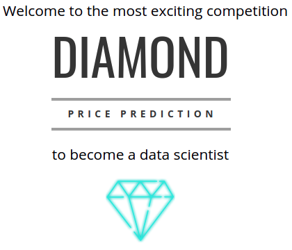
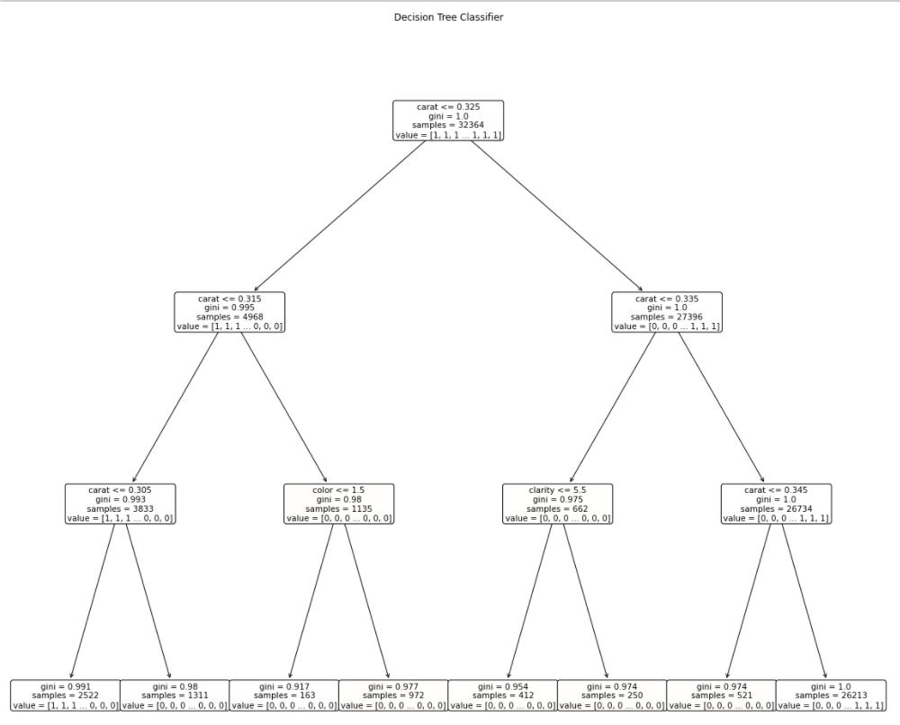

# Predincting Diamond Prices
## Ironhack's Data Analytics Bootcamp Project nº VI: Diamond Kaggle Competition

---
The **main goal** of this project is to predict the price of diamonds based on what we have learned in class the previous week about Supervised Machine Learning techniques.

## About the project
In this project we have to participate in a Kaggle competition where the model that best predicts diamonds prices (the model that has the lowest RMSE) is the one who wins.

**Diamond characteristics**:
- id
- price
- carat
- cut
- color
- clarity
- x
- y
- z
- depth
- table

## Data
The data has been source from a [Kaggle](https://www.kaggle.com/c/diamonds-datamad1020/data) database.

## Steps
1. First, we explore the dataset in order to understand the data. We prepare it, select features and extract those we are most interest in.

2. Second, we convert categorical data (cut, color, clarity) to numerical by creating a dictionary with the values we have considered are more/less important.

3. Third, we test different regression Machine Learning algorithms to see which one returns a lower RMSE.

    To do so, we train-test split the data with the *train* dataset. Once we are happy with the result, we test the model with the *prediction* dataset.
    
    Models used:
    - Model 1: **Linear Regression**
    - Model 2: **Logistic Regression**
    - Model 3: **Random Forest Regressor**
        - Model 3.1 : with **GridSearchCV**
    - Model 4: **Decision Tree Classifier**

4. Finally, we submit the different tested models into Kaggle to check which one has a lower RMSE and highest score among the competitors.

---

## Challenges
- Jupyter Notebook would get very easily over loaded and cells wouldn't execute. For instance, it would take sometimes around 15 minutes to execute a cell, and in some cases it wouldn't even execute. This barrier has many it pretty difficult to run cells smoothly.

- Too many number of estimations in the Random Forest Regression model. I tried 1.500, 2.000 and 10.000 estimations and the first two would work (but taking a long time to execute), and the third didn't even execute. I understand this is due to the high number of estimations. Also, with 1.500 and 2.000 estimations, the RMSE was higher than with 1.000, which meant that the model vas overfitting (that is why I stuck with 1.000 estimations).

- GridSearchCV didn't work out because the kernel was taking too long to load and wouldn't stop returning outputs with multiple hyperparameters.

- Not being able to check the score and RMSE from the submissions in Kaggle. This in particular was very challenging since we were working "blindly" and we couldn't check right away how accurate and flexible the model was, in order to change it and improve it.

- Time constraint

---
## Final thoughts & Improvements

The primary goal of this project was to try different models of Supervised Machine Learning techniques, which has been done. Nevertheless, there is much more work that can be done to improve those models and find the optimal one to predict diamond prices.

Therefore, as future improvements I would:
- Try to stick with one model and optimize it
- Try other models, such as Lasso or Ridge
- Make GridSearchCV work
